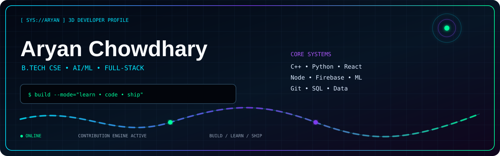

<div align="center">



<br><br>


</div>

## `> whoami`

```text
Aryan Chowdhary
B.Tech Computer Science & Engineering • 3rd Year

AI/ML + Full-Stack Developer in progress.
I learn by building, debugging and shipping practical projects.
```

## `TECH MATRIX`

| Layer | Stack |
|---|---|
| Languages | C • C++ • Python • JavaScript |
| Frontend | React • React Native • HTML • CSS • Tailwind |
| Backend | Node.js • Express |
| Database / Cloud | MongoDB • Firebase / Firestore • SQL |
| AI / Data | NumPy • Pandas • Matplotlib • Scikit-learn |
| Tools | Git • GitHub • VS Code • Android Studio |

## `BUILDING`

- 🧠 AI-powered applications
- 📱 React Native mobile projects
- 🤖 Machine Learning projects
- 🧩 DSA + problem solving
- 🚀 Better GitHub projects and open-source habits

## `PROJECTS`

### Resume Analyzer
AI-assisted resume analysis project.

**Stack:** TypeScript • React • Vite • Tailwind • Supabase

→ [Repository](https://github.com/aryan200611/Resume-Analyzer)

### Pandas / Data Practice
Python and Pandas learning and data-analysis work.

→ [Repository](https://github.com/aryan200611/Pandas)

### Walk2Earn
React Native rewards-app concept using activity tracking, wallet/transactions and Firebase.

**Stack:** React Native • Expo • Firebase • AsyncStorage

---

<div align="center">
  
</div>

## `GITHUB METRICS`

<div align="center">


<br><br>


</div>

---

<div align="center">

```text
BUILD  →  LEARN  →  DEBUG  →  SHIP  →  REPEAT
```

</div>
